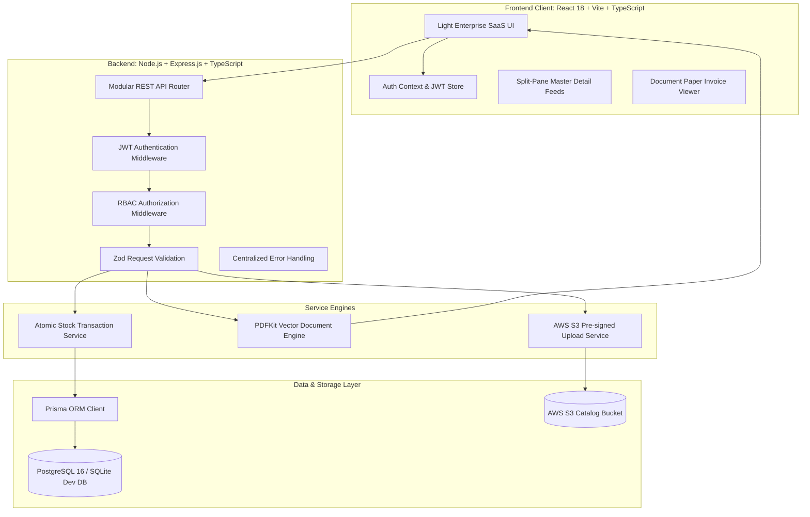
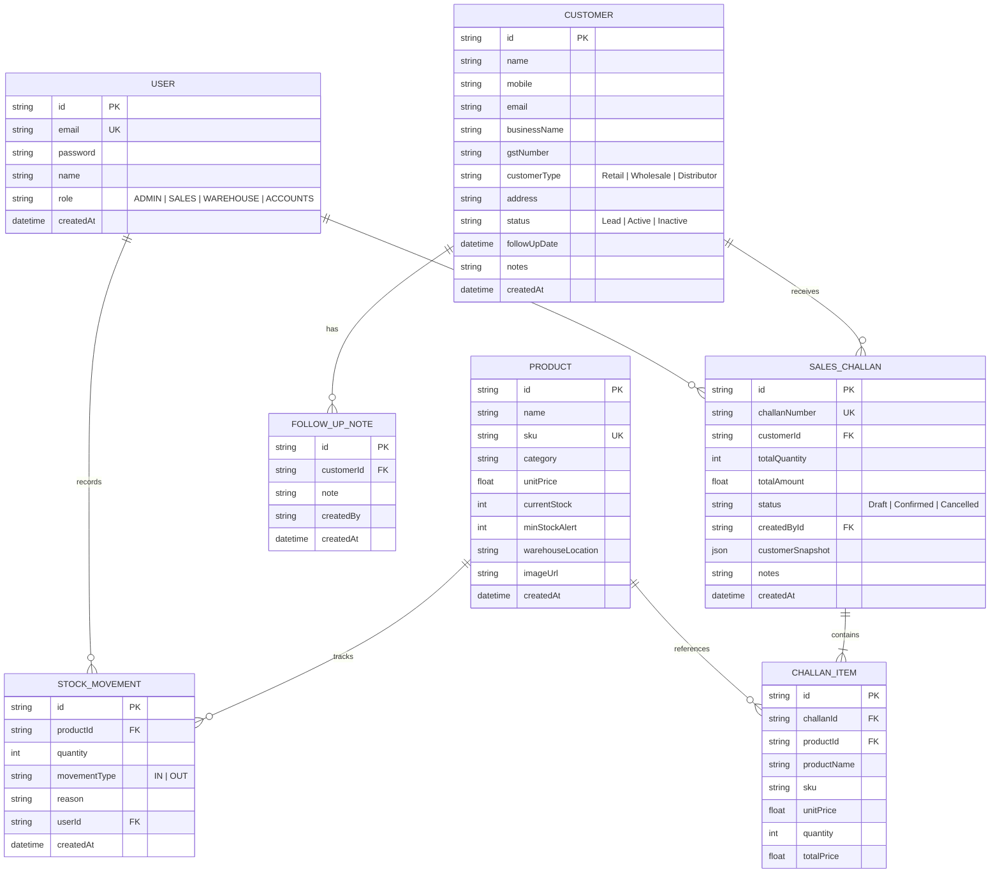

# Nexora — Business Operations & CRM Platform
## Comprehensive Technical & Functional Documentation

---

## Executive Summary

**Nexora** is a full-stack, enterprise-grade Mini ERP and CRM Operations Platform designed specifically for wholesale, industrial supply, and distribution enterprises. It unifies customer relationship management, SKU-level inventory tracking, automated delivery challan sequencing, atomic stock reduction, and high-fidelity PDF invoicing under a role-based access control (RBAC) security model.

The platform was built to satisfy all specifications outlined in the **Full Stack Developer Case Study**, delivering both core business logic and advanced production-grade bonus capabilities (Docker containerization, GitHub Actions CI/CD, PDF generation, and AWS S3 product image integration).

- **GitHub Repository**: [https://github.com/Akhilkanta05/Nexora-Ops-CRM-Platform](https://github.com/Akhilkanta05/Nexora-Ops-CRM-Platform)
- **Local API Endpoint**: `http://localhost:5000`
- **Local Web Application**: `http://localhost:5173`
- **Active Test Suite**: `15 / 15 Passed (100%)`

---

## 1. System Architecture & Tech Stack

### High-Level Architecture Diagram



### Technology Stack Specifications

| Layer | Technology | Rationale & Implementation Details |
| :--- | :--- | :--- |
| **Backend Runtime** | **Node.js (v24 LTS) & TypeScript** | Static type checking, modern ES modules, async/await concurrency. |
| **HTTP Framework** | **Express.js** | Lightweight, modular routing with custom middleware for JWT and RBAC. |
| **Database ORM** | **Prisma ORM** | Type-safe queries, migration engine, automated relation joins, and atomic `$transaction` support. |
| **Primary Database** | **PostgreSQL 16 / SQLite** | Dual schema architecture: SQLite for zero-config local testing and PostgreSQL for production Docker/cloud deployments. |
| **Validation Engine** | **Zod** | Strict schema validation on request payloads and query parameters before hitting controllers. |
| **Document Engine** | **PDFKit** | Programmatic vector PDF rendering for delivery challans and tax invoices with company GSTIN and line item tables. |
| **Cloud Storage** | **AWS S3 SDK v3** | Pre-signed URL generation for direct and secure product image uploads (`@aws-sdk/client-s3`). |
| **Frontend Framework**| **React 18 & Vite** | Lightning-fast HMR builds, component modularity, hooks-based state management. |
| **Styling & Aesthetics**| **Vanilla CSS & Design Tokens**| Handcrafted light enterprise design system inspired by modern SaaS apps (no bloated CSS frameworks). |
| **Containerization** | **Docker & Docker Compose** | Multi-stage Dockerfiles for backend and frontend (Nginx reverse proxy) alongside PostgreSQL 16. |
| **CI/CD Pipeline** | **GitHub Actions** | Automated workflow verifying linting, TypeScript compilation, backend test suites, and Vite bundles. |

---

## 2. Database Design & Entity Relationship Diagram (ERD)

The database schema is modeled with referential integrity, foreign key cascading, and snapshot isolation:



---

## 3. Core Modules & Business Logic Implementation

### 3.1. Authentication & Role-Based Access Control (RBAC)

Nexora enforces role boundaries at both API endpoint middleware and frontend UI views.

#### User Roles & Capabilities:
- **`ADMIN`**: Global supervisor with unrestricted access across CRM, Inventory, Challans, Financial Reports, and Platform Configuration.
- **`SALES`**: Commercial distribution lead. Manages Customers, adds CRM follow-up notes, builds multi-product Challans in `Draft` or `Confirmed` status.
- **`WAREHOUSE`**: Logistics & stock custodian. Manages Product SKUs, performs manual stock adjustments (`IN`/`OUT`) with audit reasons, confirms challans for inventory deduction, monitors low stock alerts.
- **`ACCOUNTS`**: Financial compliance officer. Views customers, audits confirmed sales orders, downloads signed PDF Delivery Challans & Tax Invoices, audits revenue KPIs.

#### Security Implementation:
- Passwords are salted and hashed with **10 rounds of bcrypt** (`bcryptjs`).
- Sessions authenticate via standard **Bearer JWT** tokens with 24-hour expiration.
- Custom Express middleware `authorizeRoles(...roles)` rejects unauthorized actors with `HTTP 403 Forbidden`.
- The frontend features a quick 1-click **Role Switcher** on both the login screen and top navigation bar for seamless evaluation.

---

### 3.2. Customer CRM Module

Designed for wholesale account management and lead progression:
- **Comprehensive Profiles**: Tracks Contact Name, Business Legal Name, Phone, Email, GSTIN (optional), Delivery Address, Account Status (`Lead`, `Active`, `Inactive`), and Customer Classification (`Retail`, `Wholesale`, `Distributor`).
- **Real-Time Debounced Search & Filter**: Filter by status and type; search dynamically across contact name, business name, phone, email, and GSTIN.
- **CRM Follow-Up Timeline Drawer**: Slide-out drawer displaying full contact details, order history, and chronological follow-up note logs with author stamps.
- **Follow-Up Scheduling**: Dedicated follow-up dates trigger upcoming alerts on the dashboard and notification center.

---

### 3.3. Product & Inventory Management

Engineered to prevent stockouts and maintain an immutable inventory ledger:
- **SKU Catalog**: Stores Product Title, SKU code (unique), Category, Unit Price (INR), Current Stock, Minimum Stock Alert Threshold, and Warehouse Bay Location.
- **Proactive Low-Stock Alerts**: Visual warning indicators and pulsating alert pills trigger whenever `currentStock <= minStockAlert`. A filter switch allows warehouse staff to isolate low-stock items requiring re-order.
- **Manual Stock Adjustments with Audit Trail**:
  - Supports `IN` (Intake/Restock/Return) and `OUT` (Damaged/Defective/Internal Transfer).
  - Enforces mandatory audit reasons (`Reason is mandatory for audit compliance`).
  - Records an immutable `StockMovement` row tracking quantity, actor, reason, and exact timestamp.

---

### 3.4. Sales Challans & Invoicing Engine

The core operational workflow handles orders from draft creation to warehouse dispatch and invoice generation:

#### Sequential Number Generation:
- Generates professional, sequential challan numbers using format:
  $$\text{CH-YYYYMMDD-XXXX}$$
- Auto-increments counter for daily uniqueness (e.g. `CH-20260910-0001`).

#### Multi-Item Dynamic Builder:
- Sales reps select a registered customer and add dynamic product rows with live available stock indicators and automated row/grand totals.
- Challans can be saved as `Draft` or directly `Confirmed`.

#### Atomic Stock Deduction & Negative Stock Guard:
- When a challan transitions to `Confirmed`, an atomic transaction (`prisma.$transaction`) executes:
  1. Checks current stock for all line items.
  2. If $\text{currentStock} < \text{requestedQty}$ for any item, the transaction **aborts completely** and returns an itemized `HTTP 400 Bad Request`:
     ```json
     {
       "success": false,
       "message": "Cannot confirm challan due to insufficient stock: Industrial Impact Drill - In Stock: 4, Required: 10"
     }
     ```
  3. Stock **never goes negative**.
  4. Deducts stock atomically for all items and creates immutable `StockMovement` logs of type `OUT`.

#### Historical Snapshot Preservation:
- To protect accounting records from future catalog changes:
  - `customerSnapshot`: Serialized snapshot of customer name, business, GSTIN, and address at time of creation.
  - `ChallanItem`: Stores line-item snapshot of `productName`, `sku`, and `unitPrice`. Subsequent edits to catalog prices will never alter historical invoices.

#### Challan Cancellation & Stock Rollback:
- Cancelling a confirmed challan runs a reverse atomic transaction: increments warehouse stock back and writes an `IN` stock movement with reason `"Sales Challan Cancellation (CH-XXXX)"`.

#### High-Fidelity PDF Export:
- Streaming PDF generation using **PDFKit** via `GET /api/challans/:id/pdf`.
- Generates formatted documents featuring company header, customer delivery details, line-item grid, bank settlement details, and authorized signature blocks.

---

### 3.5. Workspace & Account Suite

- **Account (`Account.tsx`)**: User identity details, assigned department, interactive 7-module role authorization matrix, password reset, and active JWT session monitor.
- **History (`History.tsx`)**: Unified chronological audit trail combining Inventory Movements, Challans, and CRM lead creation with filter controls and **One-Click CSV Export**.
- **Notifications (`Notifications.tsx`)**: Live alert stream notifying users of low stock threshold breaches, upcoming CRM follow-ups, and dispatch orders with quick action shortcuts.
- **Settings (`Settings.tsx`)**: Admin-controlled enterprise configuration (company legal name, GSTIN, default payment terms, challan prefix) and departmental preferences (primary bay, default customer type, tax specifications).

---

## 4. Complete REST API Reference

All protected endpoints require `Authorization: Bearer <JWT_TOKEN>`.

### Authentication Endpoints
| Method | Endpoint | Allowed Roles | Description |
| :--- | :--- | :--- | :--- |
| `POST` | `/api/auth/login` | Public | Sign in with email & password. Returns JWT token & user profile. |
| `GET` | `/api/auth/me` | Authenticated | Inspect currently logged-in user profile & role. |
| `GET` | `/api/auth/demo-accounts` | Public | List demo accounts for rapid evaluation. |

### Customer CRM Endpoints
| Method | Endpoint | Allowed Roles | Description |
| :--- | :--- | :--- | :--- |
| `GET` | `/api/customers` | Admin, Sales, Warehouse, Accounts | Paginated list with search (`search=`) and filters (`status=`, `type=`). |
| `GET` | `/api/customers/:id` | Admin, Sales, Warehouse, Accounts | Detailed customer record including past challans & timeline notes. |
| `POST` | `/api/customers` | Admin, Sales | Create customer with Zod validation. |
| `PUT` | `/api/customers/:id` | Admin, Sales | Update customer details. |
| `POST` | `/api/customers/:id/notes` | Admin, Sales | Add chronological CRM follow-up note with author attribution. |

### Product & Inventory Endpoints
| Method | Endpoint | Allowed Roles | Description |
| :--- | :--- | :--- | :--- |
| `GET` | `/api/products` | Admin, Sales, Warehouse, Accounts | Product catalog with low-stock filter (`lowStock=true`) and category filter. |
| `GET` | `/api/products/:id` | Admin, Sales, Warehouse, Accounts | Get single product by ID. |
| `POST` | `/api/products` | Admin, Warehouse | Create product SKU with bay location and alert threshold. |
| `PUT` | `/api/products/:id` | Admin, Warehouse | Update product details. |
| `POST` | `/api/products/:id/adjust-stock` | Admin, Warehouse | Adjust stock (`IN`/`OUT`) with mandatory audit reason. |
| `GET` | `/api/products/logs/movements` | Admin, Sales, Warehouse, Accounts | System-wide stock movement audit trail. |
| `POST` | `/api/products/upload-url` | Admin, Warehouse | Generate AWS S3 pre-signed upload URL for product catalog images. |

### Sales Challan Endpoints
| Method | Endpoint | Allowed Roles | Description |
| :--- | :--- | :--- | :--- |
| `GET` | `/api/challans` | Admin, Sales, Warehouse, Accounts | List sales challans with status filter (`Draft`, `Confirmed`, `Cancelled`). |
| `GET` | `/api/challans/:id` | Admin, Sales, Warehouse, Accounts | Full challan detail with line items and customer snapshot. |
| `POST` | `/api/challans` | Admin, Sales | Create multi-item challan. Deducts stock atomically if `status="Confirmed"`. |
| `PATCH` | `/api/challans/:id/status` | Admin, Sales, Warehouse | Update challan status. Performs atomic deduction on confirmation or restoration on cancellation. |
| `GET` | `/api/challans/:id/pdf` | Admin, Sales, Warehouse, Accounts | Stream vector PDF Delivery Challan & Tax Invoice. |

### Dashboard & Analytics Endpoints
| Method | Endpoint | Allowed Roles | Description |
| :--- | :--- | :--- | :--- |
| `GET` | `/api/dashboard/overview` | Admin, Sales, Warehouse, Accounts | Returns aggregated KPIs (Customers, Inventory, Low-Stock SKUs, Revenue, Recent Activity). |

---

## 5. Automated Verification & Testing

The backend includes a dedicated automated test suite ([test-suite.ts](file:///c:/Users/kanta/OneDrive/Documents/projects/projects/funsrooms/backend/test-suite.ts)) executing 15 business logic test cases:

```bash
cd backend
npm test
```

### Test Results Breakdown:
- ✅ **Test 1**: All 4 test user roles exist in database (`ADMIN`, `SALES`, `WAREHOUSE`, `ACCOUNTS`).
- ✅ **Test 2**: Admin user account exists and is queryable.
- ✅ **Test 3**: Password hashing and verification with `bcryptjs` works correctly.
- ✅ **Test 4**: Customer records exist in database.
- ✅ **Test 5**: Customer CRM timeline notes link to customer record.
- ✅ **Test 6**: Products catalog populated with SKU codes.
- ✅ **Test 7**: Low stock alert threshold logic correctly isolates products where `currentStock <= minStockAlert`.
- ✅ **Test 8**: Stock adjustment `IN` increments inventory correctly.
- ✅ **Test 9**: Stock adjustment `OUT` decrements inventory correctly.
- ✅ **Test 10**: Rejection of excessive stock deduction returns HTTP `400 Bad Request`.
- ✅ **Test 11**: Stock Service atomic transaction prevents stock from going negative.
- ✅ **Test 12**: Challan transitions from `Draft` to `Confirmed`.
- ✅ **Test 13**: Stock is atomically deducted upon challan confirmation.
- ✅ **Test 14**: AWS S3 product image upload service generates valid upload URL (Bonus Point).
- ✅ **Test 15**: Test cleanup and transactional data isolation.

**Final Result**: `15 Passed, 0 Failed (100% Pass Rate)`

---

## 6. Deployment & DevOps Guide

### 6.1. Docker Compose (Zero-Config Local Production)

Run the entire platform (PostgreSQL 16, Express API, and React frontend with Nginx) with a single command:

```bash
docker-compose up --build
```

- **Frontend**: `http://localhost:3000` (Reverse-proxied via Nginx)
- **Backend API**: `http://localhost:5000`
- **PostgreSQL**: `localhost:5432` (`nexora_db`)

### 6.2. Free Cloud Deployment (Recommended)

1. **Database**: [Neon.tech](https://neon.tech) or [Supabase](https://supabase.com) PostgreSQL (Free Tier). Set connection string in `DATABASE_URL`.
2. **Backend**: [Render.com](https://render.com) or [Railway](https://railway.app). Set root to `backend`, build command to `npm install && npx prisma generate && npm run build`, start command to `node dist/server.js`.
3. **Frontend**: [Vercel](https://vercel.com) or [Netlify](https://netlify.com). Set root to `frontend`, framework preset to `Vite`, build command to `npm run build`, output directory to `dist`. Set `VITE_API_URL` to the backend URL.

### 6.3. AWS Production Deployment Architecture

- **Compute**: AWS Elastic Beanstalk (Node.js runtime) or AWS ECS / Fargate container using `backend/Dockerfile`.
- **Database**: AWS RDS PostgreSQL (`db.t3.micro` free tier) with automated snapshots.
- **Frontend Hosting**: AWS S3 Static Website Hosting distributed via **AWS CloudFront** with SSL certificate from AWS Certificate Manager (ACM).
- **Product Images**: Dedicated private **AWS S3 Bucket** with IAM upload policies utilizing pre-signed URLs generated by `S3Service`.

---

## 7. Submission Credentials & Verification Checklist

### Test Accounts
| Role | Email | Password | Primary Scope |
| :--- | :--- | :--- | :--- |
| **Admin** | `admin@nexora.com` | `Admin@123` | Full administrative control across all operations |
| **Sales** | `sales@nexora.com` | `Sales@123` | Customer CRM, lead notes, Challan builder |
| **Warehouse** | `warehouse@nexora.com` | `Warehouse@123` | Stock adjustments, audit logs, low-stock warnings |
| **Accounts** | `accounts@nexora.com` | `Accounts@123` | Invoices, revenue KPIs, PDF downloads |

### Submission Deliverables Checklist
- [x] **1. GitHub Repository Link**: [https://github.com/Akhilkanta05/Nexora-Ops-CRM-Platform](https://github.com/Akhilkanta05/Nexora-Ops-CRM-Platform)
- [x] **2. Working Local Setup**: Backend on `http://localhost:5000`, Frontend on `http://localhost:5173`
- [x] **3. Test Login Credentials for All Roles**: Provided above and accessible in UI
- [x] **4. Postman Collection**: Ready to import in root as [postman_collection.json](file:///c:/Users/kanta/OneDrive/Documents/projects/projects/funsrooms/postman_collection.json)
- [x] **5. README with Setup & Architecture**: Comprehensive guide in [README.md](file:///c:/Users/kanta/OneDrive/Documents/projects/projects/funsrooms/README.md)
- [x] **6. Automated Verification Tests**: `15 / 15 Passed` via `npm test`
- [x] **7. Bonus: Docker Setup**: [docker-compose.yml](file:///c:/Users/kanta/OneDrive/Documents/projects/projects/funsrooms/docker-compose.yml)
- [x] **8. Bonus: GitHub Actions**: [.github/workflows/ci.yml](file:///c:/Users/kanta/OneDrive/Documents/projects/projects/funsrooms/.github/workflows/ci.yml)
- [x] **9. Bonus: Export Invoice as PDF**: Built with PDFKit
- [x] **10. Bonus: AWS S3 Product Image Upload**: Built with `@aws-sdk/client-s3`
